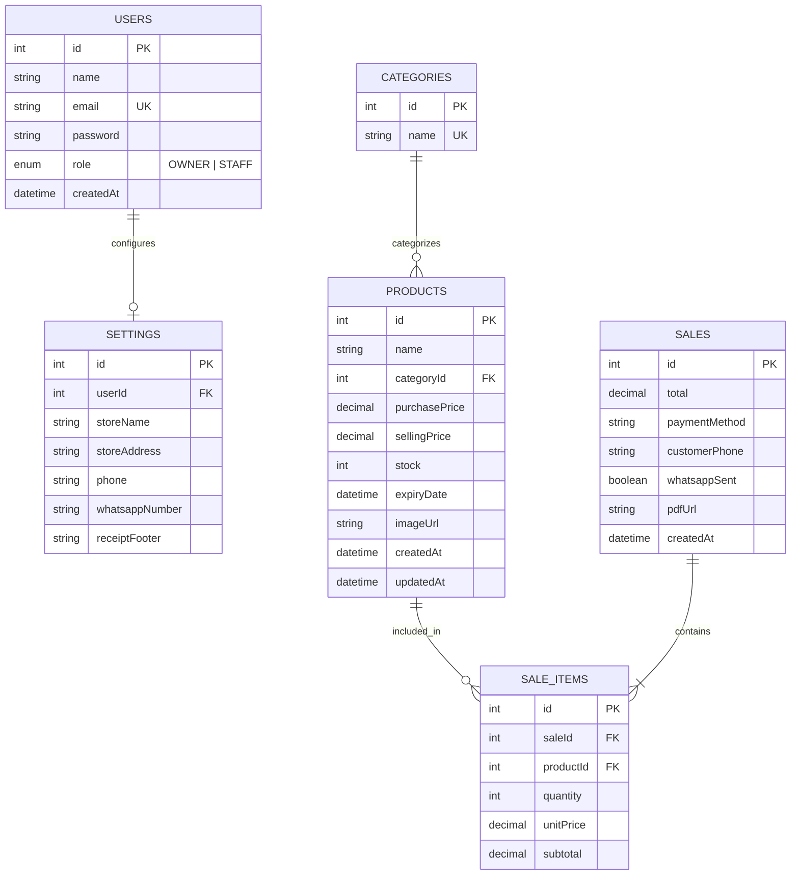
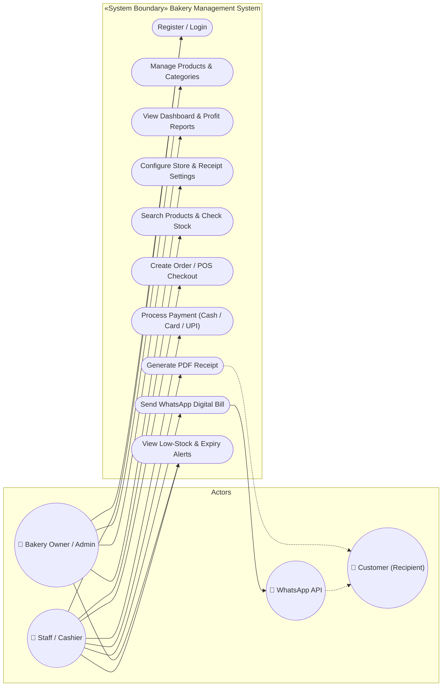
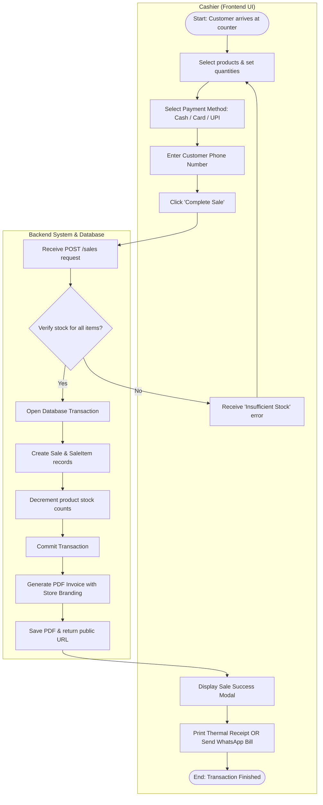

# Smart Bakery Management & POS System — BakeTrack
## Software Project Management — Project Report / Assignment
### All 5 Questions

---

| # | Topic |
| :--- | :--- |
| **Q1** | Problem Statement |
| **Q2** | Software Requirements Specification (SRS) |
| **Q3** | Entity Relationship (ER) Diagram |
| **Q4** | Use Case Diagram |
| **Q5** | Activity Diagram |

---

# Q1. Problem Statement

Small, artisan, and independent bakeries manage their daily operations using manual paper registers, basic spreadsheets, or generic calculators. These traditional tools were designed for general retail — not for perishable food products. When it comes to knowing what freshly baked batches are on the shelves, when cream and dairy items will spoil, and what the real daily net profit is, traditional tools provide no useful guidance.

The core problem is structural. Bakery items (pastries, custom cakes, bread loaves, cookies, dairy desserts) have short and critical shelf lives ranging between 1 to 7 days. Existing generic billing systems treat all items as static non-perishable inventory. They fail to track expiry dates at the product level, do not trigger proactive alerts before food spoils, and do not track purchase/ingredient costs alongside selling prices. As a result, bakery owners suffer silent financial leakages, high inventory wastage, stockouts during peak rush hours, and slow manual billing bottlenecks.

There is also a customer communication gap. Paper receipts are easily misplaced, create unnecessary paper waste, and prevent bakeries from adopting modern instant digital delivery channels like WhatsApp.

### Key Problems Identified:
- **No Automated Expiry Tracking:** Perishable bakery items expire unnoticed on shelves, leading to direct food wastage, financial loss, and food safety concerns.
- **Stockout & Inventory Gaps:** No real-time stock deduction during billing, causing sudden shortages of fast-selling items during rush hours.
- **Slow Manual Billing Queues:** Manual price lookups and paper bill calculation create long queues during morning and evening peak hours.
- **No True Profit/Loss Visibility:** Revenue is tracked without accounting for unit cost/purchase prices, leaving owners unaware of true net profits.
- **Inefficient Paper Receipts:** Paper bills are costly, easily lost by customers, and lack direct digital sharing capabilities.
- **No Staff Role Segregation:** Lack of user access boundaries allows any employee to view private business margins or modify product pricing.

### Formal Problem Statement:
*Design and develop a web-based smart bakery inventory and Point-of-Sale (POS) management system that manages product categories, tracks real-time stock levels, triggers automated alerts for low stock ($\le 5$ units) and upcoming expiries (within 7 days), enables rapid touch-based checkout with multi-payment modes, calculates net profit margins against product cost prices, generates downloadable PDF receipts, and provides one-click WhatsApp digital invoice delivery.*

---

# Q2. Software Requirements Specification (SRS)

## 2.1 Functional Requirements

### Authentication & Access Control
- **FR-01:** Users can log in using their email and password. On successful authentication, a secure JWT session token is issued.
- **FR-02:** User passwords must be securely hashed with `bcrypt` before being stored in the database. Plain text passwords are never stored.
- **FR-03:** The system supports Role-Based Access Control (RBAC) with two roles: `OWNER` (Admin) and `STAFF` (Cashier).
- **FR-04:** All private API endpoints require a valid JWT token; unauthenticated requests are rejected with HTTP 401.
- **FR-05:** Sensitive management routes (viewing profit margins, modifying store profile, deleting products) are strictly restricted to the `OWNER` role.

### Category & Product Management
- **FR-06:** The system allows creating, viewing, updating, and deleting product categories (e.g., Cakes, Pastries, Breads, Cookies, Beverages).
- **FR-07:** Each product includes Name, Category, Purchase Price (Cost), Selling Price, Current Stock, Expiry Date, and an optional Image.
- **FR-08:** Product search supports instant, case-insensitive partial name matching and category filtering.
- **FR-09:** Product prices must be positive decimal values, and stock counts must be non-negative integers.

### Inventory & Stock Management
- **FR-10:** Product stock is tracked in real-time and updated immediately upon adding stock or completing sales.
- **FR-11:** If an order quantity exceeds available stock, the system rejects the transaction with an "Insufficient Stock" error.
- **FR-12:** Low-stock threshold is fixed at $\le 5$ units to alert staff before items run completely out of stock.
- **FR-13:** Stock decrements during sales are executed within an ACID database transaction to prevent inventory mismatches.

### Point of Sale (POS) & Checkout
- **FR-14:** The POS interface provides a responsive catalog with instant search and category quick-filter tabs.
- **FR-15:** Cashiers can add items, increment/decrement quantities, and view running subtotals and grand totals in real-time.
- **FR-16:** Checkout supports multiple payment methods: `Cash`, `Card`, and `UPI / Online Transfer`.
- **FR-17:** Cashiers can optionally enter a customer's phone number to link the sale for digital invoice delivery.

### Expiry & Low-Stock Alerts
- **FR-18:** The notifications feed automatically queries and displays all items flagged as `LOW_STOCK` (stock $\le 5$).
- **FR-19:** The system checks product expiry dates and flags items expiring within the next 7 days as `EXPIRING`.
- **FR-20:** Expired products (expiry date $<$ today) are visually highlighted with urgent warning indicators.
- **FR-21:** Notification badges update dynamically across the application on every relevant view.

### Invoicing, PDF & WhatsApp Dispatch
- **FR-22:** Upon sale completion, the backend automatically generates a PDF invoice containing store details, itemized table, and grand total.
- **FR-23:** PDF invoices are saved to static storage and linked to the sale record with a public URL.
- **FR-24:** The system provides a one-click WhatsApp share button that opens a pre-filled WhatsApp message with the bill summary and download link.
- **FR-25:** The POS interface supports direct receipt printing for thermal/A4 physical receipt printers.

### Reports & Profit Tracking
- **FR-26:** Reports support custom date range filtering (e.g., Today, This Week, This Month, or Custom From-To Dates).
- **FR-27:** The reporting engine aggregates total revenue, total bills count, and net profit calculated as:
  $$\text{Net Profit} = \sum (\text{Selling Price} - \text{Purchase Price}) \times \text{Quantity Sold}$$
- **FR-28:** Reports display a ranked list of top-selling bakery items by quantity sold and total revenue generated.

---

## 2.2 Non-Functional Requirements

- **NFR-01 (Responsiveness):** Fully responsive web interface optimized for desktop PCs, laptops, and POS touch-screen tablets.
- **NFR-02 (Low Latency):** POS product search and cart calculation must respond within **100 ms**; checkout completion within **1.5 seconds**.
- **NFR-03 (Data Integrity):** Database operations use PostgreSQL with Prisma ORM foreign key constraints and transactional integrity.
- **NFR-04 (Security):** All API communication is secured via JWT bearer tokens, and input validation is enforced on all endpoints.
- **NFR-05 (Reliability):** Failed sale transactions roll back completely without partial stock deductions or orphaned invoice records.
- **NFR-06 (Ease of Maintenance):** Modular backend architecture (NestJS) and component-based frontend (React + Vite).

---

# Q3. Entity Relationship (ER) Diagram

The Bakery Management System database consists of 6 core relational entities: **USERS**, **SETTINGS**, **CATEGORIES**, **PRODUCTS**, **SALES**, and **SALE_ITEMS**. 

Each product belongs to a Category and can appear in multiple Sale Items. Each Sale contains one or more Sale Items and captures total revenue, payment method, customer phone number, and the generated PDF invoice link.

### Key Database Relationships

| From Entity | Relationship | To Entity | Meaning |
| :--- | :---: | :--- | :--- |
| **USERS** | 1 : 1 | **SETTINGS** | Each user/owner configures one store profile and receipt branding. |
| **CATEGORIES** | 1 : N | **PRODUCTS** | One category contains multiple bakery products (e.g., Cakes $\rightarrow$ Red Velvet, Black Forest). |
| **PRODUCTS** | 1 : N | **SALE_ITEMS** | A product can be purchased across multiple sale transactions. |
| **SALES** | 1 : N | **SALE_ITEMS** | One customer bill contains one or more itemized product lines. |

---

# Q4. Use Case Diagram

The system involves two primary internal actors (**Bakery Owner / Admin** and **Staff / Cashier**) and two external actors/systems (**Customer** and **WhatsApp Web API**).

### Actor Summary

| Actor | Role Type | Primary Use Cases |
| :--- | :--- | :--- |
| **Bakery Owner** | Primary Internal | Manage user accounts, add/edit products & categories, set cost/selling prices, view net profit analytics, configure store branding. |
| **Staff / Cashier** | Primary Internal | Search products, operate POS terminal, process customer payments, generate PDF bills, trigger WhatsApp receipts, check low stock alerts. |
| **Customer** | External Recipient | Receives printed receipt or digital WhatsApp invoice link on their mobile device. |
| **WhatsApp Web API** | External System | Receives pre-formatted invoice text and public receipt PDF URL to deliver to the customer's phone. |

---

# Q5. Activity Diagram

The Activity Diagram depicts the **Point-of-Sale (POS) Checkout & Billing Flow** — the primary transaction workflow in the Bakery Management System. The process is split into two swimlanes: **Cashier (User Interface)** and **Backend System (API & Database)**.

### POS Checkout Algorithm — Step by Step

- **Step 1:** Cashier adds selected bakery products to the cart and adjusts quantities.
- **Step 2:** System calculates live line subtotals and the total amount.
- **Step 3:** Cashier selects payment mode (`Cash`, `Card`, or `UPI`) and enters the customer's phone number.
- **Step 4:** Cashier clicks **"Complete Sale"**, sending a `POST /sales` payload to the backend.
- **Step 5:** Backend checks current database inventory for every item in the cart.
- **Step 6:** If any item's stock is insufficient $\rightarrow$ Transaction is aborted and a descriptive error is returned.
- **Step 7:** If stock is valid $\rightarrow$ An ACID database transaction creates the `Sale` and `SaleItem` rows and immediately decrements product stock.
- **Step 8:** Database transaction commits successfully.
- **Step 9:** PDFKit engine builds a branded vector PDF receipt and saves it to static storage.
- **Step 10:** Backend returns the sale confirmation with `pdfUrl`. The UI opens the receipt modal with options to print or dispatch via WhatsApp.

---

### Other Key System Workflows

1. **Product Addition & Stock-In:**
   - Owner enters product details $\rightarrow$ sets Cost Price, Selling Price, Stock, and Expiry Date $\rightarrow$ System saves product $\rightarrow$ Item is immediately available in the POS catalog.

2. **Expiry & Low-Stock Classification:**
   - On page load $\rightarrow$ System fetches active products $\rightarrow$ calculates $\text{Days Remaining} = \text{Expiry Date} - \text{Current Date}$ $\rightarrow$ flags items where $\text{Days Remaining} \le 7$ as `EXPIRING` and items where $\text{Stock} \le 5$ as `LOW_STOCK` $\rightarrow$ renders alert badges.

3. **WhatsApp Receipt Sharing:**
   - Cashier clicks "Send via WhatsApp" $\rightarrow$ System encodes pre-filled greeting, bill total, and invoice URL into a `https://wa.me/<phone>?text=...` URI $\rightarrow$ opens WhatsApp Web/App ready to send.

4. **Profit & Loss Report Generation:**
   - Owner selects date range $\rightarrow$ Backend queries all sales within the range $\rightarrow$ iterates each sale item $\rightarrow$ computes $\text{Profit} = (\text{Selling Price} - \text{Cost Price}) \times \text{Quantity}$ $\rightarrow$ returns total revenue, net profit, and best-selling item rankings.

---
